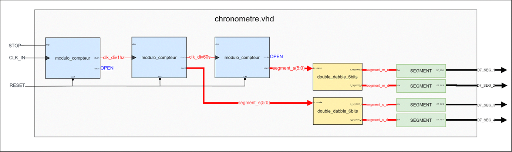

# FPGA Digital Stopwatch

A digital stopwatch implemented in VHDL for the DE10-Lite MAX 10 FPGA board. It displays minutes and seconds on four seven-segment displays, with pause/resume and reset controls.

## Overview

The stopwatch counts from **00:00 to 59:59**, then wraps back to **00:00**. All sequential logic in the current RTL uses the board's **50 MHz clock**. A counter divides 50 million clock cycles into one-second intervals; a one-cycle enable advances the minute counter when the seconds wrap from 59 to 00.

Pause freezes both the seconds counter and the subsecond divider, so counting resumes from the saved position. Reset has priority over pause.

## Repository Structure

```text
fpga-stopwatch/
├── rtl/                      # Active VHDL source files
│   ├── Chronometre.vhd       # Top-level connections and display mapping
│   ├── diviseur_seconde.vhd  # Time base, seconds counter and minute enable
│   ├── counter_minute.vhd    # Minutes counter, modulo 60
│   ├── double_dabble.vhd     # Six-bit binary to two BCD digits
│   └── mux.vhd               # BCD to active-low seven-segment decoder
├── quartus/
│   ├── Chronometre.qpf       # Quartus project
│   ├── Chronometre.qsf       # Device, source files and pin assignments
│   └── Chronometre.sdc       # 50 MHz base clock constraint
├── doc/
│   └── main_architecture.png # Diagram from the original project notes
├── .gitignore
└── README.md
```

## Architecture



The diagram presents the functional chain: time base, seconds, minutes, binary-to-BCD conversion and seven-segment decoding. In the current source files, the time base and seconds counter are combined in `diviseur_seconde.vhd`. The minute counter uses `OV_seconde` as an enable on the 50 MHz clock, rather than as a separate clock.

| Module | Function |
| --- | --- |
| `Chronometre.vhd` | Connects counters, two BCD converters and four display decoders. |
| `diviseur_seconde.vhd` | Generates one-second intervals, counts seconds from 0 to 59 and emits the minute enable. |
| `counter_minute.vhd` | Counts minutes from 0 to 59 when the enable is asserted. |
| `double_dabble.vhd` | Converts a six-bit binary value to decimal tens and units using shift-and-add-3. |
| `mux.vhd` | Decodes one BCD digit into an active-low seven-segment pattern. |

Despite its name, `mux.vhd` is a display decoder. The original source filenames have been preserved.

## Controls and Display

| Signal | Behaviour |
| --- | --- |
| `MAX10_CLK1_50` | 50 MHz system clock. |
| `SW[0] = 0` | Run / resume. |
| `SW[0] = 1` | Pause. |
| `SW[1] = 1` | Synchronous reset; hold high to keep the stopwatch at zero. |
| `HEX3` / `HEX2` | Minutes: tens / units. |
| `HEX1` / `HEX0` | Seconds: tens / units. |

The decimal points are off. After reset, set `SW[1]` to 0 and `SW[0]` to 0 to start counting.

## Getting Started

### Requirements

- DE10-Lite board and USB-Blaster connection.
- Quartus Prime with MAX 10 device support. The original project records Quartus Prime 25.1 Lite Edition as its last version.

The device assignment is preserved from the original project: `10M50DAF484C6GES`. Check it against the FPGA fitted to your board before compiling.

### Build and Program

1. Open `quartus/Chronometre.qpf` in Quartus Prime.
2. Confirm the device and top-level entity (`chronometre`).
3. Run a full compilation and review the timing reports. The `.sdc` declares a 20 ns period for the 50 MHz oscillator.
4. Connect the board and open the Quartus Programmer.
5. Select the USB-Blaster, load `quartus/output_files/Chronometre.sof`, enable **Program/Configure** and click **Start**.
6. Reset with `SW[1]`, release it, then use `SW[0]` to run or pause.

## Validation Status

This repository packages the existing RTL without changing its behaviour. Source-file identity, relative references and the 35 used pin assignments have been checked. A new Quartus compilation, timing closure and hardware validation of this reorganised project have **not** been performed.

The external switches are used directly in the original RTL. Synchronisation of those inputs and external I/O timing constraints remain to be reviewed before claiming a fully validated hardware implementation.

## Skills

`VHDL` · `RTL Design` · `Counters` · `Clock Enable` · `Binary to BCD` · `Seven-Segment Display` · `Intel Quartus Prime` · `MAX 10 FPGA`
